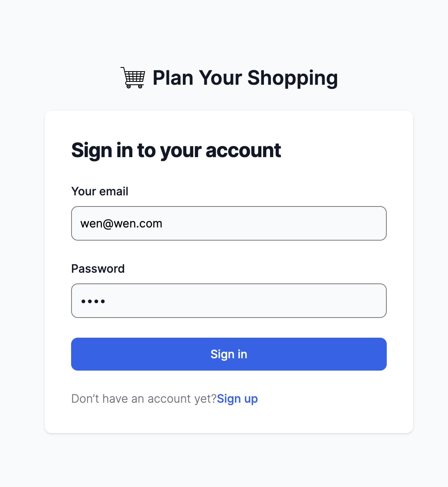
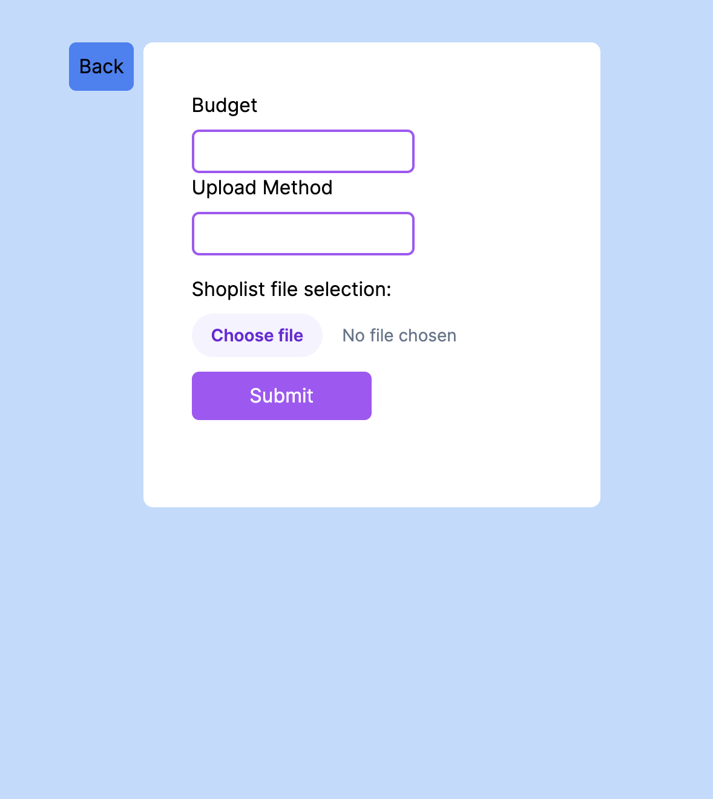

[Web Link](https://shop-plan.netlify.app/)

## § Shoplsit Flask API Postman Documentation
[API Documentation](https://documenter.getpostman.com/view/19703585/2s93sjVpDe)

## § Terminal App Features
1. user input budget and provide shoplist txt file 

2. According to user input, simulate the product list data retrieving online
use selenium to accumulate user browsing activity and beutifulsoup to extract searching data needed

3. Analyzing searching data and comparing with product keywords and budget, save results in file
* calculate total price of each possible combinations
* match keywords and budget in the shoplist provided in first step, get the final matched results and show results in terminal or saved in local csv file for user to check 

## § App instructions

1. git clone 'repo link'

2. move server folder outside shopplans folder

3. server setup
> cd server

    python3 -m venv .venv
    python3 -m pip install -r requirements.txt
    . .venv/bin/activate
    add your own DATABASE_URL & SECRET_KEY
    flask db create && flask db seed
    flask run

3. client setup
> cd shopplans

    replace api url in app/base_api/base_api.ts
    yarn
    yarn dev

## § App Interface Screenshot

*program in development mode

